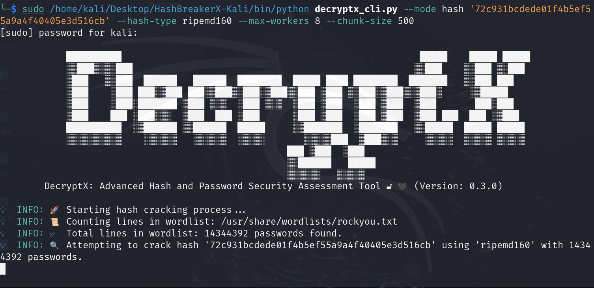
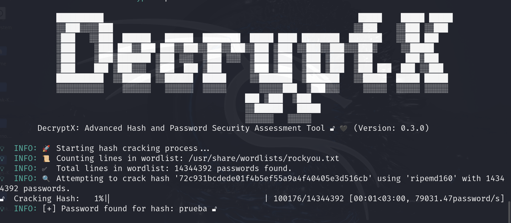
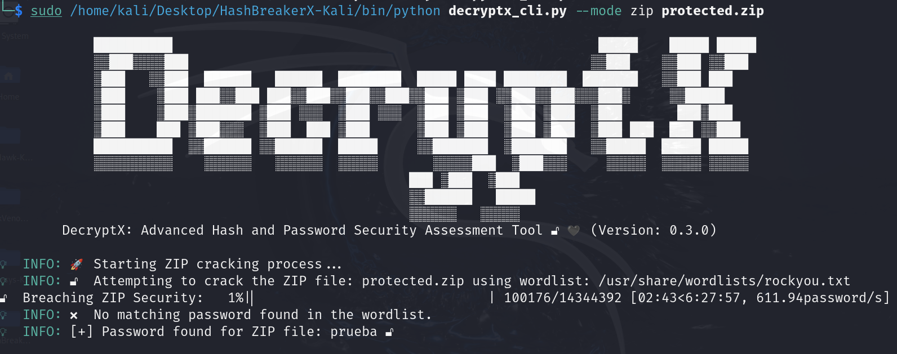
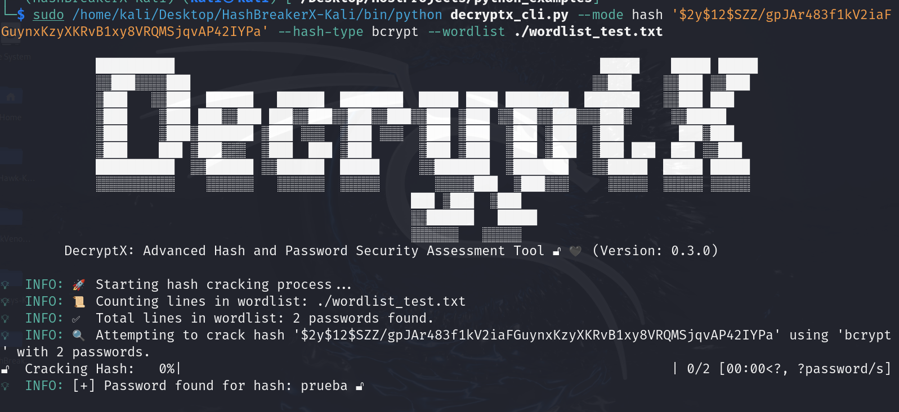

# 🔐 **DecryptX: Advanced Hash and Password Security Assessment Tool** 🛠️  

DecryptX is a professional-grade ethical hacking tool designed for cybersecurity experts and penetration testers. Specializing in analyzing password hashes and encrypted ZIP files, it allows users to assess the robustness of their security implementations. With support for standard hash algorithms and encrypted archives, DecryptX combines precision, speed, and reliability to identify vulnerabilities before attackers do.  

🙏 I would like to express my sincere gratitude to [Santiago Hernández, a leading expert in Cybersecurity and Artificial Intelligence](https://www.udemy.com/user/shramos/). His outstanding course on **Cybersecurity and Ethical Hacking**, available on Udemy, was instrumental in the development of this project. The insights and techniques I gained from his course were invaluable in guiding my approach to cybersecurity practices. Thank you for sharing your knowledge and expertise!

> ⚠️ **Disclaimer**: This tool is intended for educational and ethical hacking purposes only. Always ensure you have proper authorization before testing any systems.

<p align="center">
  
  
</p>

<p align="center">
  
</p>

## ⚠️ Disclaimer  

**DecryptX** was created **solely for educational and research purposes** as part of my **cybersecurity learning journey**. This project serves as a **practical application of the concepts acquired during my ethical hacking training**, allowing me to **experiment in a controlled environment** and include it in my **cybersecurity portfolio**.  

This tool is designed **exclusively for ethical security assessments** and **authorized penetration testing**. It must **only be used on systems for which the user has explicit permission**.  

Any **unauthorized use of DecryptX to crack passwords or gain unauthorized access to encrypted data** is **illegal** and may violate laws.  

**I take no responsibility for any misuse of this tool.** Users must ensure they operate **within legal and ethical boundaries** at all times.  


## 🌟 **Explore My Other Open-Source Ethical Hacking Tools**

If you're interested in more powerful tools for ethical hacking, make sure to check out my other open-source projects designed to help cybersecurity professionals and penetration testers:

- [🦅 **NetHawk**](https://github.com/sergio11/nethawk_analyzer): A state-of-the-art **AI-powered ethical hacking tool** for **network vulnerability assessment**. Using advanced frameworks like **Scapy** and **Nmap**, NetHawk automates **port scanning**, **vulnerability detection**, and **report generation**, making security audits faster, smarter, and more efficient. Whether you're a **network administrator**, **cybersecurity expert**, or **ethical hacker**, NetHawk simplifies the assessment process and offers actionable insights to fortify your systems.
- [💀 **Nemesys**](https://github.com/sergio11/nemesys): An advanced **exploitation** and **post-exploitation** tool built on top of the **Metasploit Framework** for automating critical data harvesting and system enumeration.  
- [🕷️ **BlackVenom**](https://github.com/sergio11/blackvenom): The ultimate **ARP** and **DNS spoofing** tool for **intercepting network traffic** and uncovering vulnerabilities with stealth and precision.  
- [🌐 **ZeroTrace**](https://github.com/sergio11/zero_trace_hacking_tool): A powerful **search engine dorking** tool designed to identify **attack vectors** and uncover **exposed sensitive information** across the web.
- [🔐 **DecryptX**](https://github.com/sergio11/decryptx): An **advanced hash and password security assessment tool** that empowers you to analyze **password hashes**, **encrypted ZIP files**, and more. Ideal for evaluating the strength of encryption and identifying weaknesses in **security implementations**.
- [ 🌑 **EclipseRecon**](https://github.com/sergio11/eclipserecon): is a stealthy web reconnaissance tool for uncovering hidden vulnerabilities, subdomains, and site structures. 🕵️‍♂️🔍 It empowers security professionals to identify critical attack surfaces with precision, ensuring proactive defense. 🚨💻
- [ 🌐 **ZoneGuardian**](https://github.com/sergio11/zoneguardian): A powerful tool to analyze DNS configurations, detect vulnerabilities, and generate actionable security reports. 🔒🚀 Safeguard your digital assets with precision and ease!
- [🔍 **Retrospect**](https://github.com/sergio11/retrospect): A cutting-edge **reconnaissance and security analysis tool** that retrieves and analyzes historical web snapshots, helping you uncover past vulnerabilities and misconfigurations before they can be exploited today. Ideal for **ethical hackers** and **digital forensics experts**.

These tools are designed to streamline penetration testing, enhance security assessments, and provide in-depth insights into vulnerabilities. Explore them to level up your ethical hacking skills! 💻🔍

## ✨ **Key Features**  

- 🔑 **Password Cracking**  
  Efficiently recover lost or forgotten passwords using a combination of brute-force and dictionary-based attacks.  
  - **Brute-Force Attack**: Attempts all possible combinations of characters within a specified range.  
  - **Dictionary Attack**: Leverages wordlists, including custom and pre-built ones like `rockyou.txt`, to match against potential passwords.  
  - **Multithreading Support**: Maximizes cracking speed by utilizing modern multi-core CPUs.  

- 🔐 **Hash Cracking**  
  DecryptX supports a wide array of modern and legacy hash algorithms, allowing security professionals to test for weaknesses in password storage mechanisms.  
  - **Supported Algorithms**: Includes MD5, SHA-1, SHA-2 (SHA-224, SHA-256, SHA-384, SHA-512), SHA-3, bcrypt, argon2, and more.  
  - **Customizable Workflow**: Allows you to select the hash type and tailor the cracking approach to specific security assessments.  
  - **Progress Tracking**: Provides real-time feedback with progress bars to monitor the cracking process.  

- 📂 **Encrypted ZIP Cracking**  
  Quickly bypass ZIP file password protections to access encrypted content.  
  - **AES Encrypted ZIPs**: Supports modern AES-encrypted ZIP files often encountered in enterprise settings.  
  - **Custom Dictionary**: Use tailored wordlists for improved success rates in password recovery.  
  - **Error Handling**: Automatically skips invalid attempts or corrupted entries to ensure uninterrupted processing.  
  - **Safe Extraction**: Avoids overwriting files by verifying successful decryption before extraction.  

Each feature is designed to handle real-world scenarios with efficiency and accuracy, ensuring cybersecurity professionals have a robust toolset for ethical hacking and vulnerability assessments.

<p align="center">
  
</p>

## 🔧 **Supported Algorithms**  

DecryptX supports a wide range of algorithms, including modern standards and legacy ones often required for specific security assessments:  

### **Modern Algorithms:**  

- **BLAKE2 (`blake2b`, `blake2s`)**  
  Fast and secure, designed to replace SHA-2.  

- **SHA-2 (`sha1`, `sha224`, `sha256`, `sha384`, `sha512`)**  
  Widely used in secure protocols like HTTPS and digital signature systems.  

- **SHA-3 (`sha3_224`, `sha3_256`, `sha3_384`, `sha3_512`)**  
  Based on **Keccak**, offering advanced resistance to collision attacks.  

- **RIPEMD-160 (`ripemd160`)**  
  A cryptographic alternative to MD5 and SHA-1, used in blockchain and other environments.  

- **bcrypt**  
  Designed for password protection, with support for scalable cost factors.  

- **scrypt**  
  Resistant to hardware attacks (ASIC), ideal for systems handling sensitive passwords.  

- **argon2**  
  A modern and secure password hashing algorithm, winner of **PHC 2015**.  

### **Legacy Algorithms:**  

- **MD5 (`md5`)**  
  Considered insecure for most modern applications but still required in older systems.  

- **MD4 (`md4`)**  
  Predecessor to MD5, even less secure, occasionally used in very old applications.  

- **SHA-1 Variant (`sha1_v2`)**  
  A custom version of SHA-1, used for specific applications.  

- **CRC32 (`crc32`)**  
  More suited for integrity verification than cryptographic security.

<p align="center">
  
</p>

## 📜 **Prerequisites**  

Before using **DecryptX**, make sure you have the following dependencies installed:

- 🐍 **Python 3.8+**  
  DecryptX requires Python version 3.8 or higher. You can download the latest version of Python from the official [Python website](https://www.python.org/downloads/).

- 📦 **Required Python Libraries**  
  DecryptX utilizes a set of Python libraries for functionality such as cryptographic hashing, password cracking, progress tracking, and ZIP file handling. Below are the required libraries that you need to install:

  - **`bcrypt==4.2.1`**  
    A fast and secure password hashing library used for working with bcrypt hashes, commonly used in modern password storage systems. This library is essential for verifying bcrypt hashed passwords.
  
  - **`tqdm==4.67.1`**  
    A fast, extensible progress bar library for Python. DecryptX uses `tqdm` to display progress bars during cracking operations, making it easier to track the status of hash and ZIP file cracking processes.
  
  - **`passlib==1.7.4`**  
    A comprehensive password hashing library. `Passlib` is used in DecryptX to handle various hashing algorithms, including bcrypt and Argon2, providing secure password hashing capabilities.
  
  - **`colorama==0.4.6`**  
    A cross-platform library to output colored terminal text. This library is used for enhanced logging and error message formatting, making the tool's output more user-friendly and visually appealing.
  
  - **`pyzipper==0.3.6`**  
    A powerful library for reading and writing password-protected ZIP files with support for AES encryption. `pyzipper` enables DecryptX to crack encrypted ZIP files by trying password combinations from a wordlist.
  
  - **`pycryptodome==3.21.0`**  
    A self-contained Python package for cryptographic operations. `pycryptodome` provides support for various legacy hash algorithms like MD4, RIPEMD-160, and others, enabling DecryptX to handle both modern and older hashing methods.

<p align="center">
  
</p>


### Installing Dependencies

To install all required libraries, you can use the following command:

```bash
pip install -r requirements.txt
```

This will automatically install all the dependencies listed in the requirements.txt file for you.


## 📜 **Usage Examples**

Below are some examples of how to use DecryptX for different tasks. Make sure to replace the placeholders like `<mode>`, `<hash-type>`, and `<path-to-wordlist>` with the appropriate values for your use case.

### 1. **Cracking a ZIP File**
To attempt to crack a password-protected ZIP file using a wordlist, use the following command:

```bash
sudo /home/kali/Desktop/HashBreakerX-Kali/bin/python decryptx_cli.py --mode zip protected.zip
```

### 2. Cracking a Hash (bcrypt)
To crack a bcrypt hash, use the following example. You need to specify the hash and the hash type (bcrypt in this case):

```bash
sudo /home/kali/Desktop/HashBreakerX-Kali/bin/python decryptx_cli.py --mode hash '$2y$12$SZZ/gpJAr483f1kV2iaFGuynxKzyXKRvB1xy8VRQMSjqvAP42IYPa' --hash-type bcrypt --wordlist ./wordlist_test.txt
```

### 3. Cracking MD4 Hash
To crack an MD4 hash using a specific wordlist and setting a limit on the number of workers and chunk size, use the following command:

```bash
sudo /home/kali/Desktop/HashBreakerX-Kali/bin/python decryptx_cli.py --mode hash 'a60d68f8f094bddb23d7ee23a37c831a' --hash-type md4 --max-workers 8 --chunk-size 500 --wordlist ./wordlist_test.txt
```

### 4. Cracking RIPEMD-160 Hash
For cracking a RIPEMD-160 hash, specify the hash type (ripemd160), number of workers, and chunk size:

```bash
sudo /home/kali/Desktop/HashBreakerX-Kali/bin/python decryptx_cli.py --mode hash '72c931bcdede01f4b5ef55a9a4f40405e3d516cb' --hash-type ripemd160 --max-workers 8 --chunk-size 500 --wordlist ./wordlist_test.txt
```

### 5. Cracking PBKDF2-HMAC (with SHA-256)
To crack a PBKDF2-HMAC hash with SHA-256, use the following command:

```bash
sudo /home/kali/Desktop/HashBreakerX-Kali/bin/python decryptx_cli.py --mode hash '4b4fbc4642c4c349a06bb67f44ee764d8a15cf540b0a73943e1c37c8a450828f' --hash-type pbkdf2_hmac --max-workers 8 --chunk-size 500
```

### 6. Cracking CRC32 Hash
For cracking a CRC32 hash, use the following:

```bash
sudo /home/kali/Desktop/HashBreakerX-Kali/bin/python decryptx_cli.py --mode hash 'b3eb4cc1' --hash-type crc32 --max-workers 8 --chunk-size 500
```

### General Command Structure
Here is the general structure for running the tool with any mode and hash type:

```bash
sudo /path/to/decryptx_cli.py --mode <mode> --hash-type <hash-type> --wordlist <path-to-wordlist> <additional-options>
```
Where:
- `<mode>` is either `zip` or `hash` depending on your task.
- `<hash-type>` is the type of hash you're cracking (e.g., `bcrypt`, `md5`, `sha256`).
- `<path-to-wordlist>` is the path to your wordlist file.
- `<additional-options>` can include options like `--max-workers`, `--chunk-size`, etc.

## ⚠️ Disclaimer  

**DecryptX** was created **solely for educational and research purposes** as part of my **cybersecurity learning journey**. This project serves as a **practical application of the concepts acquired during my ethical hacking training**, allowing me to **experiment in a controlled environment** and include it in my **cybersecurity portfolio**.  

This tool is designed **exclusively for ethical security assessments** and **authorized penetration testing**. It must **only be used on systems for which the user has explicit permission**.  

Any **unauthorized use of DecryptX to crack passwords or gain unauthorized access to encrypted data** is **illegal** and may violate laws.  

**I take no responsibility for any misuse of this tool.** Users must ensure they operate **within legal and ethical boundaries** at all times.  

## Acknowledgements 🙏

🙏 I would like to express my sincere gratitude to [Santiago Hernández, a leading expert in Cybersecurity and Artificial Intelligence](https://www.udemy.com/user/shramos/). His outstanding course on **Cybersecurity and Ethical Hacking**, available on Udemy, was instrumental in the development of this project. The insights and techniques I gained from his course were invaluable in guiding my approach to cybersecurity practices. Thank you for sharing your knowledge and expertise!

## 🤝 **Contributing**
Contributions to DecryptX are highly encouraged! If you're interested in adding new features, resolving bugs, or enhancing the project's functionality, please feel free to submit pull requests.

## Get in Touch 📬

DecryptX is developed and maintained by **Sergio Sánchez Sánchez** (Dream Software). Special thanks to the open-source community and the contributors who have made this project possible. If you have any questions, feedback, or suggestions, feel free to reach out at  [dreamsoftware92@gmail.com](mailto:dreamsoftware92@gmail.com).

## Visitors Count


 
 ## Please Share & Star the repository to keep me motivated.
  <a href = "https://github.com/sergio11/decryptx/stargazers">
     
  </a>


## License ⚖️

This project is licensed under the MIT License, an open-source software license that allows developers to freely use, copy, modify, and distribute the software. 🛠️ This includes use in both personal and commercial projects, with the only requirement being that the original copyright notice is retained. 📄

Please note the following limitations:

- The software is provided "as is", without any warranties, express or implied. 🚫🛡️
- If you distribute the software, whether in original or modified form, you must include the original copyright notice and license. 📑
- The license allows for commercial use, but you cannot claim ownership over the software itself. 🏷️

The goal of this license is to maximize freedom for developers while maintaining recognition for the original creators.

```
MIT License

Copyright (c) 2024 Dream software - Sergio Sánchez 

Permission is hereby granted, free of charge, to any person obtaining a copy
of this software and associated documentation files (the "Software"), to deal
in the Software without restriction, including without limitation the rights
to use, copy, modify, merge, publish, distribute, sublicense, and/or sell
copies of the Software, and to permit persons to whom the Software is
furnished to do so, subject to the following conditions:

The above copyright notice and this permission notice shall be included in all
copies or substantial portions of the Software.

THE SOFTWARE IS PROVIDED "AS IS", WITHOUT WARRANTY OF ANY KIND, EXPRESS OR
IMPLIED, INCLUDING BUT NOT LIMITED TO THE WARRANTIES OF MERCHANTABILITY,
FITNESS FOR A PARTICULAR PURPOSE AND NONINFRINGEMENT. IN NO EVENT SHALL THE
AUTHORS OR COPYRIGHT HOLDERS BE LIABLE FOR ANY CLAIM, DAMAGES OR OTHER
LIABILITY, WHETHER IN AN ACTION OF CONTRACT, TORT OR OTHERWISE, ARISING FROM,
OUT OF OR IN CONNECTION WITH THE SOFTWARE OR THE USE OR OTHER DEALINGS IN THE
SOFTWARE.
```


